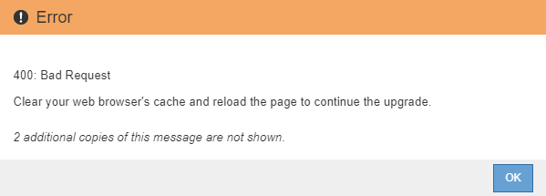

= Starten des Upgrades
:allow-uri-read: 
:icons: font
:imagesdir: ../media/

[role="lead"]
Wenn Sie bereit sind, das Upgrade auszuführen, wählen Sie die heruntergeladene Datei aus, und geben Sie die Provisionierungs-Passphrase ein. Als Option können Sie die Upgrade-Vorabprüfungen durchführen, bevor Sie das tatsächliche Upgrade durchführen.

.Was Sie benötigen
Sie haben alle Überlegungen geprüft und alle Schritte unter durchgeführt link:upgrade-planning-and-preparation.html["Planung und Vorbereitung von Upgrades"].

.Schritte
. Melden Sie sich über einen unterstützten Browser beim Grid Manager an.
. Wählen Sie *Wartung* *System* *Software-Update*.
+
Die Seite Software-Aktualisierung wird angezeigt.

. Wählen Sie *StorageGRID-Upgrade*.
+
Die Seite StorageGRID-Upgrade wird angezeigt und zeigt Datum und Uhrzeit des zuletzt abgeschlossenen Upgrades an, es sei denn, der primäre Admin-Node wurde neu gestartet oder die Management-API wurde seit der Durchführung des Upgrades neu gestartet.

. Wählen Sie die aus `.upgrade` Heruntergeladene Datei.
+
.. Wählen Sie *Durchsuchen*.
.. Datei suchen und auswählen: `NetApp_StorageGRID_version_Software_uniqueID.upgrade`
.. Wählen Sie *Offen*.
+
Die Datei wird hochgeladen und validiert. Wenn der Validierungsprozess abgeschlossen ist, wird neben dem Dateinamen der Aktualisierungsdatei ein grünes Häkchen angezeigt.

. Geben Sie die Provisionierungs-Passphrase in das Textfeld ein.
+
Die Schaltflächen *Run Prechecks* und *Start Upgrade* werden aktiviert.

+
image::../media/storagegrid_upgrade_buttons_enabled.png[Die Schaltflächen für die StorageGRID-Aktualisierung sind aktiviert]

. Wenn Sie den Zustand Ihres Systems vor dem eigentlichen Upgrade validieren möchten, wählen Sie *Prechecks ausführen*. Lösen Sie dann alle Fehler, die vor der Prüfung gemeldet werden.
+

IMPORTANT: Wenn Sie benutzerdefinierte Firewall-Ports geöffnet haben, werden Sie während der Vorabprüfung-Validierung benachrichtigt. Bevor Sie das Upgrade durchführen, müssen Sie sich an den technischen Support wenden.

+

NOTE: Die gleichen Vorabprüfungen werden durchgeführt, wenn Sie *Upgrade starten* auswählen. Durch die Auswahl von *Vorprüfungen ausführen* können Sie Probleme erkennen und beheben, bevor Sie das Upgrade starten.

. Wenn Sie bereit sind, das Upgrade auszuführen, wählen Sie *Upgrade starten*.
+
Es wird eine Warnung angezeigt, die Sie daran erinnert, dass die Verbindung Ihres Browsers beim Neustart des primären Admin-Knotens unterbrochen wird. Wenn der primäre Admin-Node wieder verfügbar ist, müssen Sie den Cache Ihres Webbrowsers löschen und die Seite Software-Upgrade neu laden.

+
image::../media/software_upgrade_connection_will_be_lost.png[Die Verbindung Zum Software-Upgrade Geht Verloren]

. Wählen Sie * OK*, um die Warnung zu bestätigen und den Aktualisierungsvorgang zu starten.
+
Wenn das Upgrade beginnt:

+
.. Die Upgrade-Vorabprüfungen werden durchgeführt.
+

NOTE: Wenn Fehler bei der Vorprüfung gemeldet werden, beheben Sie diese und wählen Sie erneut *Upgrade starten*.

.. Der primäre Admin-Node wird aktualisiert, was auch das Beenden von Diensten, das Aktualisieren der Software und den Neustart von Diensten umfasst. Sie können nicht auf den Grid Manager zugreifen, während der primäre Admin-Node aktualisiert wird. Auch Audit-Protokolle sind nicht verfügbar. Dieses Upgrade kann bis zu 30 Minuten in Anspruch nehmen.
+

NOTE: Während der primäre Admin-Node aktualisiert wird, werden mehrere Kopien der folgenden Fehlermeldungen angezeigt, die Sie ignorieren können.

+
image::../media/software_upgrade_problem_connecting_error.png[Fehler Bei Der Verbindung Des Software-Upgrades]

+
image::../media/software_upgrade_503_error.png[Fehler Beim Software-Upgrade 503]

+

. Nachdem der primäre Admin-Node aktualisiert wurde, löschen Sie den Cache Ihres Webbrowsers, melden Sie sich wieder an und laden Sie die Seite Software-Upgrade neu.
+
Anweisungen hierzu finden Sie in der Dokumentation Ihres Webbrowsers.

+

IMPORTANT: Sie müssen den Cache des Webbrowsers löschen, um veraltete Ressourcen zu entfernen, die von der vorherigen Version der Software verwendet werden.

.Verwandte Informationen
link:upgrade-planning-and-preparation.html["Planung und Vorbereitung von Upgrades"]
